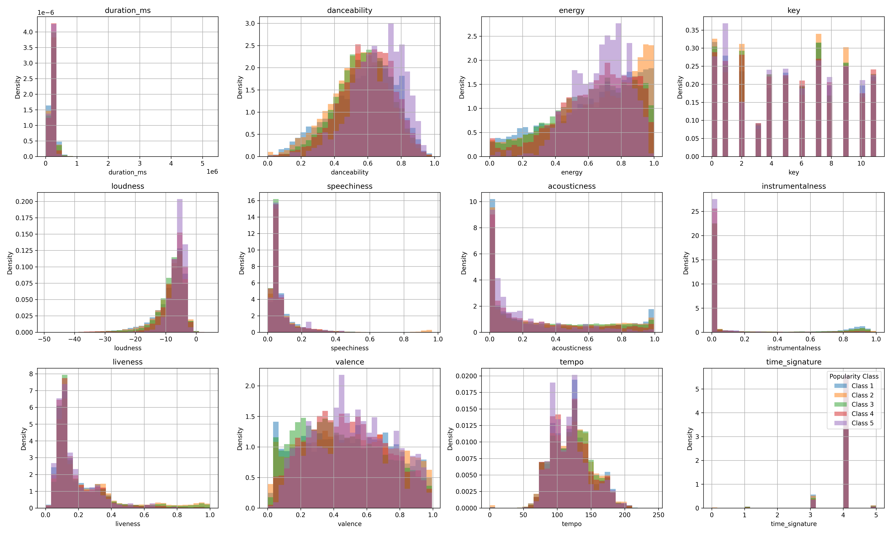
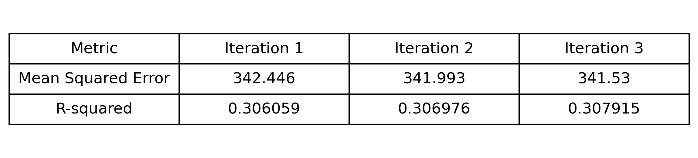

# Spotify Song Popularity Prediction

This repository outlines my attempt to use track features to predict track popularity using "Spotify Tracks Dataset" from Kaggle, found [here](https://www.kaggle.com/datasets/maharshipandya/-spotify-tracks-dataset/data)

## Overview

The task, as defined by the Kaggle challenge is to use a dataset with Spotify track information containing 21 features, to predict the popularity of each track. The approach in this repository follows a polynomial regression model and a few iterations of this model with feature adjustments. This model achieved a mean-squared error (MSE) score of 341 after 5 attempts, which is higher than the best performance on Kaggle of 227 using XGBoost models.

## Summary of Workdone

### Data

* Data:
  * Type: CSV file of tabular data consisting of numerical and categorical features
  * Size: 114,000 unique entires
  * Instances (Train, Test, Validation Split): 91,200 tracks for training, 22,800 tracks for testing, none for validation

#### Preprocessing / Clean up

* Missing values and redundant features were removed, categorical features were one-hot encoded, and data was standardized for normalization purposes. 

#### Data Visualization

### Problem Formulation

* Define:
  * Input: Features in dataset
  * Output: Track popularity prediction
  * Models
    * Linear regression: To establish a baseline set of evaluation metrics
    * Polynomial regression: To build on baseline metrics using a more complex model, with the goal of finding more complex relationships between features
    * Decision Tree: Attempted to compare against baseline and determine which model to move forward with
  * I attempted to adjust the degree hyperparameter, but was unsucessful in running the model

### Training

* Software: I trained the model using Python within a Jupyter Notebook environment. Libraries used include:
  * pandas and numpy to manipulate data
  * sci-kit learn to build models
  * matplotlib to create visualizations
* Hardware: All training and testing was done on a personal device (Macbook Air)
* Difficulties include working with a dataset with many unique identifiers and determining which were useful, alongside hardware issues and inability to run models on my device

### Performance Comparison

* Key performance metrics: R^2 and MSE

 

### Conclusions

I think this work leaves a lot to be desired. I feel that my results are okay, and the MSE is clearly affected by the choice of model, but I wasn't able to effectively adjust my hyperparameters in a way that could build on the model instead of building on the data.

### Future Work

I would like to try to replicate the same polynomial regression model on a device that could handle running the model. I am also interested in focusing on predicting popularity of a song based artists, such as using the average popularity of their music and predicting what features affect this popularity based on the artist.

### Overview of files in repository

* File descriptions:
  * initial_eda_cleaning.ipynb: Initializes CSV file, handles appropriate cleaning, establishes baseline visualizations, and saves a cleaned version of the file
  * first_models.ipynb: Tests three different models to establish a baseline, and determine model to move forward with
  * model_development: Takes the polynomial regression model and builds on it, with each iteration labeled and visualized (when possible)
